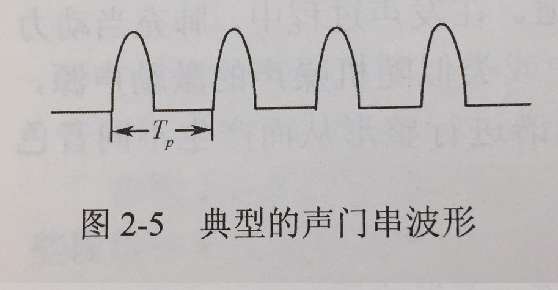
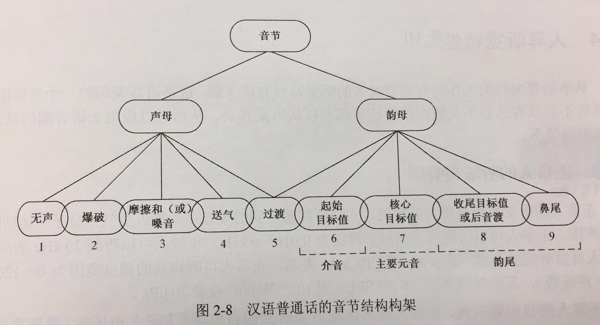
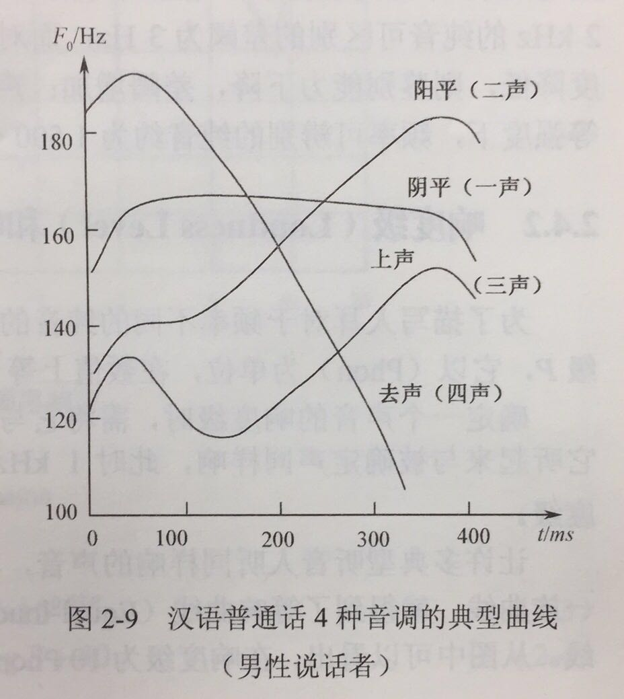

声学基础
======================================================

此部分建议详细学习《语音信号处理》韩纪庆 清华大学出版社 一书以及 实验语音学 相关书籍，下面的内容仅仅是简要的介绍
语音信号
出处：https://zhuanlan.zhihu.com/p/27778749

~~~~~~~~~~~~~~~~~~~~~~~~~~~~~~~~~~~~~~~~~~~~~~~~~~~~~~

语音信号获取
------------------------------------------------------

语音信号通过麦克风采集，经过采样和 A/D 转换后由模拟信号转变为数字信号。然后对语音的数字信号进行预加重，分帧，加窗，端点检测和滤波等处理。 预处理过后的语音信号将按照特定的特征 取方法 取出最能够表现这段语 音信号特征的参数，这些特征参数按时间序列构成了这段语音信号的特征序列。 

**采样、量化和编码**：

麦克风将声音从物理状态转化为模拟的电信号，把连续的模拟信号转化为时间上离散、但幅值上仍连续的离散模拟信号，这一过程就是采样。
通常在 PC 机上的采样频率为 16kHz，嵌入式设备上为 8kHz。

编码，就是用一组	二进制	码组来表示每一个有固定电平的量化值。然而，实际上量化是在编码过程中同时完成的，故编码过程也称为	模/数变换	，可记作A/D。

为了便于计算机计算、传输和存储，采样后的信号还要转化为能够用二进制表示的离散值，这一过程就称为 A/D 转换。保证 A/D 转换具有足够的转换精度。通常采用的方法是均匀量化和脉冲编码调制(PCM，Pulse Code Modulation)，当前语音识别中常用 16bit 量化。

**脉冲编码调制**就是把一个时间连续，取值连续的模拟信号变换成时间离散，取值离散的数字信号后在信道中传输。脉冲编码调制就是对模拟信号先抽样，再对样值幅度量化，编码的过程。

**预加重，分帧和加窗**：

高频部分在 800Hz 以上会有-6dB/倍频程的跌落，预加重的目的就是提升语音信号的高频部分，使频谱平滑。一般预加重通过一个一阶高通滤波器实现。 在对语音信号进行分析前，需要对其进行分帧，通常将语音信号的每帧长度设为 20ms，相邻两帧之间有 10ms 的重叠。为了实现分帧步骤，我们要对语音信号进行加窗操作。不同的窗口选择对语音信号分析的结果会产生影响。 通常我们选择的窗函数为汉明窗。

语音信号分析：
------------------------------------------------------
**时域分析**：

由于对信号的平方运算人为增加了高频信号和低频信号的差距，因此在某些场合可能会造成更大的误差。为了解决这个问题，最简单的方法是用短时平均幅值的变化来表示能量的变化。 短时平均过零率(ZCR，Zero Crossing Rate)是指短时间内信号通过零值的次数，具体于连续信号即其波形通过 x 轴的次数，离散信号即采样符号变化的次数。 短时过零率在一定程度上能够反映频率的高低，浊音的过零率较低，清音的过零率相对较高，因此可以用来初步分析清、浊音。短时过零率容易受到低频的干扰，通常我们在处理中还会加入门限值，即将波形穿过零点的次数改为越过门限值的次数，以此来增强抗干扰能力。 在语音信号处理中，常将短时平均能量和短时平均过零率结合起来进行语音段起始点的检测，即端点检测。当背景噪声较小时，用短时平均能量的方法比较准确，

**频域分析**：

在语音信号分析中，常用的频域分析方法有滤波器组和傅里叶变换的方法。

共振峰是一个典型的频域参数，它可以决定信号频谱的总体轮廓或谱包络(spectrum envelop)。 对于声道而言，它的共振频率不止一个，一般元音可以有3~5个共振峰。

当采用宽带带通滤波器时，频率分辨率较低，其与加窗处理中窗口较短时的处理结果相近;采用窄带带通滤波器时，频率分辨率较高，与窗口较长时的处理结果相近。 通常用一组滤波器组对语音输入信号进行滤波处理，分离出输入信号中不同中心频率的分量，再进行各种分析和处理。

通常用离散傅里叶变换代替连续傅里叶变换。但是随着技术的发展，傅里叶变换的一些局限性也渐渐体现出来:首先，傅里叶变换的时间分辨率为零，不能反映信号在时域上的信息;其次，傅里叶变换是基于信号是平稳的这个假设，而在实际生活中，很多声音信号是非平稳的;最后，傅里叶变换在整个频段内的分辨率都是相同的，不能反映信号在某一频段的某种变化。同时，将声音信号进行频率分析，计算量较大，在对实时性要求高而计算资源又受限的嵌入式设备上也是一个难题。

**语谱图**
语谱图spectrogram：横坐标表示时间，纵坐标表示频率，每个像素的灰度值大小反映相应时刻和相应频率的能量。根据带通滤波器的宽窄分为宽带语谱图和窄带语谱图。

**声学特征**：
通常我们将声学特征分为两大类，一类为基于人类发声机理的特征，另一类为基于人耳听觉感知的特征，而这两类具有代表性的特征分别是线性预测倒谱系数(LPCC，Linear Prediction Cepstrum Coefficient)和 Mel 频率倒谱系数(MFCC，Mel Frequency Cepstrum Coefficient)。 MFCC[11]特征是一种基于人类听觉感知特性的特征，模拟了人耳对不同频率的感知程度，其对中低频语音信号较敏感，对高频信息的区分度不大，因而能够从信号的中低频段 取更多语音信息。 提取一组 MFCC 特征主要有以下几个步骤: 1.首先对输入的语音信号进行预处理，得到分帧和加窗后的时域信号; 2.对时域信号进行快速傅里叶变换(FFT，Fast Fourier Transform)，得到语音信号的频率表达; 3.将得到的线性频率转换为 Mel 频率 4.在 Mel 频率轴上构造 M 个三角带通滤波器组，这 M 个三角滤波器在 Mel 频率尺度上是平均分布的。以 MFCC 为特征的语音识别系统并不会受到输入语音的音调不同而有所影响;二是降低了信息量。 5.离散余弦变换(DCT，Discrete Cosine Transform)。对每一个滤波器的输出计算其对数能量 Em ，并做 DCT 变换。

语音的产生机理与模型
参考文献：《数字语音编码技术》电子工业出版社

人的发声器官由4个部分组成：肺、喉、声道和嘴。嘴的作用是完成声道的气流向外辐射，嘴的张开形状会影响语音频谱的形状，但是其作用较之声道较弱，因此常将发音器官分成3个部分：肺、喉和声道。

肺：动力源，将气流送至喉部

喉：将来自肺部的气流调制为周期脉冲或类似随机噪声的激励声源

声道：声道包括口腔、鼻腔和咽腔，它们对声源的频谱进行整形从而产生不同音色的声音。

术语解析
------------------------------------------------------

调制：信号调制是使一种波形的某些特性按另一种波形或信号而变化的过程或处理方法。按调制信号的形式可分为模拟调制和数字调制。用模拟信号调制称为模拟调制；用数据或数字信号调制称为数字调制。

激励声源：“ 激励”与“响应”是“信号与系统”学科的两个基本概念。“激励”又称为“激励源”，是施加于系统的外部原因，而“响应”则是系统在这个外部原因作用下引起的结果。激励源即激励端口，是一种允许能量流入和流出结构的边界条件。这里将激励声源当做声音产生器就好。

**浊音和清音**

浊音时声带振动，清音时声带不振动

说话时，气流会周期性地通过声带（声带因为气流通过时产生的压力大小变化会不断地周期性闭合），从而产生周期性的脉冲气流通过。这气流的频率就称之为基音频率F0。

   图：f0

语音流中，音节(syllable)是由音素(phoneme)结合而成的最小单位，同时也是发声的最小单位。一个音节由元音(Vowel)和辅音(Consonant)构成。在汉语普通话中，每个音节都是由“辅音-元音”构成的（也有零辅音的情况），这种结构称之为"C-V"结构，其他语系中有不同的结构如“C-V-C”，汉语中辅音也称之为声母，元音称之为韵母。

单独发声的一个音节或是语音流中的任何一个音节都有可能由9个部分组成，如图所示

   图：音节发音结构

汉语普通话中有四种声调，分别是阴平、阳平、上声和去声，或成为一二三四声。声调在普通话中承担着重要的构字辨意作用。不同声调是通过基音频率的变化轨迹（也称之为声调曲线）来区分的，从一个韵母的起始端开始，到韵母的终止端结束，图中给出了单独说一个音节时4种声调的典型曲线。

   图：声调曲线

